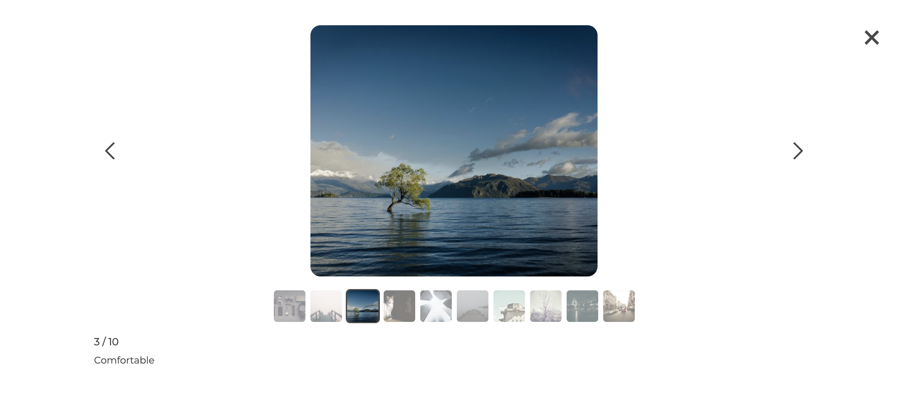

# Project Overnight: Photo Banner Service

> A service handling the photo banner to display and allow the user to browse through photos. See a photo grid displaying up to 5 images, whereby hovering over one brings the photo into focus and dimming the others. Click into the photo to see more details and access other images for the record via an image carousel.

## See The Project

> Images may no longer be hosted on S3 due to the cost of keeping everything deployed

## Related Projects

  - https://github.com/project-overnight/po-description
  - https://github.com/project-overnight/po-reservations
  - https://github.com/project-overnight/po-reviews

## Table of Contents

1. [Usage](#Usage)
1. [Requirements](#requirements)
1. [Development](#development)

## Usage

**Set up environment variables**

- Make a copy of .env_sample to add server host and port details.
- Save as .env and ensure it's added to .gitignore.

**Seed the database using seeder.js**

- Update URLs to desired links
- Insert desired starting number and records to seed by updating createSampleData(startingNumber, numberOfRecords) on line 125.
> npm run seed

**To start up the server (webpack with babel)**

> npm run build

**To start up the client**

> npm start

**To use with a proxy**

- styles.css is on the same level as index
- webpack bundles as photoBannerBundle.js
- the module component is PhotoBanner

## Requirements
This module follows [Airbnb style guide](https://github.com/airbnb/javascript)

- PostgreSql
- Express.js
- React with JSX
- Node.js

## CRUD ROUTES

- GET /api/photos/:id - Gets all the photos for the specific ID

- POST /api/photos/:id - Posts a new set of photos for a new ID

